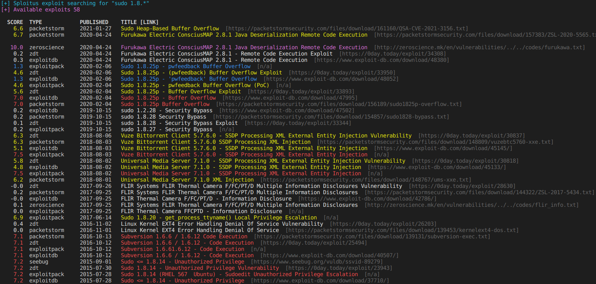

# PySploitus
Just another wrapper. This script is a wrapper for exploit/PoC search engine **Sploitus** by Vulners https://sploitus.com/.



## Install
`git clone https://github.com/adubaldo/pysploitus.git`

`pip install -r requirements.txt`

## Usage
```
usage: pysploitus.py [-h] -t {exploits,tools} -q QUERY [-m MAX | -a] [-s {date,score}]

optional arguments:
  -h, --help            show this help message and exit
  -s {date,score}, --sort {date,score}
                        sort results by date or score.

required arguments:
  -t {exploits,tools}, --type {exploits,tools}
                        type of search, exploits vs tools.
  -q QUERY, --query QUERY
                        search by keyword (e.g "wordpress 5.1")

options:
  -m MAX, --max MAX     retrieve MAX number of results.
  -a, --view-all        view all exploits found in a search, default is 10.
```
## Example

**Search and sort by date**

`python sploitcli.py -t exploits -q "sudo 1.8.*" --max 30 -s date`

**Search and sort by score**

`python sploitcli.py -t exploits "sudo 1.8.*" --view-all -s score`

**Search tools**

`python sploitcli.py -t tools "sudo 1.8.*"`

## TODO
- Save results to csv file
- Only print exploits with specific score
